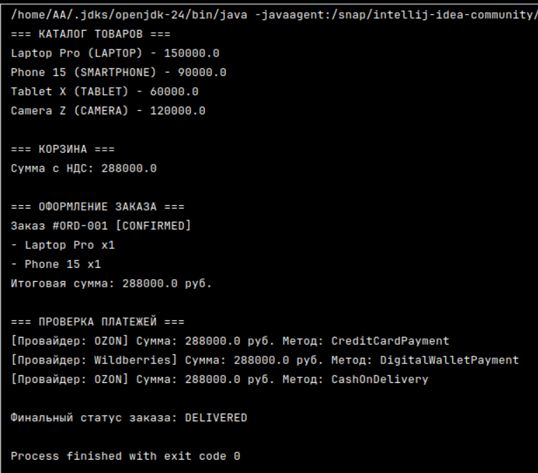

# Консольное приложение электронной коммерции

| Данные | Значение                                           |
|---|----------------------------------------------------|
| **Дисциплина** | Современные технологии программирования            |
| **Студент** | Антонова Анастасия Дмитриевна — №1 в списке группы |
| **Группа** | ПИ24-1в                                            |
| **Команда** | -                                                  |

---

## Описание проекта
Данное приложение представляет собой консольный магазин, реализованный на Java. В проекте продемонстрировано использование современных конструкций языка и паттернов проектирования для имитации процесса покупки, оформления заказа и оплаты.

### Ключевые особенности реализации:
* **Records:** Использованы для неизменяемых данных (товары, позиции корзины и заказа).
* **Sealed Interfaces:** Применены для строгого контроля методов оплаты (`PaymentMethod`).
* **Паттерн «Стратегия»:** Реализован для логики разных платежных провайдеров (Ozon, Wildberries).
* **Collections:** Для каталога и корзины применены `ArrayList` и `HashMap`.

---

## Структура пакетов
Проект организован в строгом соответствии с требованиями:
* `com.moderntech.ecommerce.main` — точка входа (`ECommerceApp`).
* `com.moderntech.ecommerce.models` — основные сущности (Product, Order, Customer и др.).
* `com.moderntech.ecommerce.payment` — логика оплаты и статусы платежей.
* `com.moderntech.ecommerce.enums` — перечисления для статусов заказа и категорий.

---

## Инструкция по запуску
1. Откройте проект в **IntelliJ IDEA Community Edition**.
2. Убедитесь, что установлен **JDK 21** или выше.
3. Перейдите в файл `src/com/moderntech/ecommerce/main/ECommerceApp.java`.
4. Нажмите правую кнопку мыши и выберите **Run 'ECommerceApp.main()'**.

---

## Скриншот работы программы

---

## Схема базы данных (ERD)
Диаграмма сущностей и связей (ERD) приложена к проекту в формате PNG. Она отражает связи между покупателем, корзиной, заказом и товарами с соблюдением кратности (cardinality).
